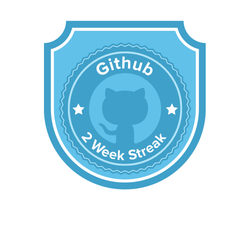
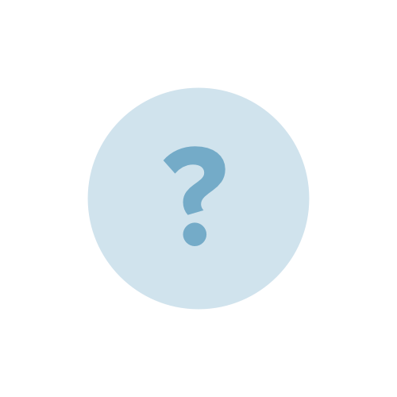
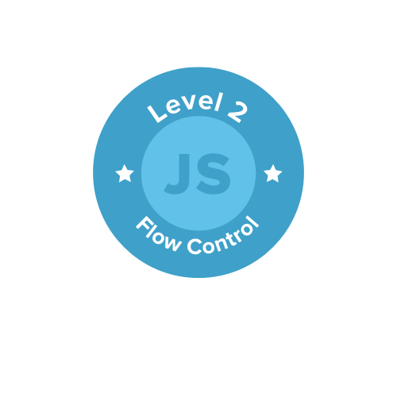
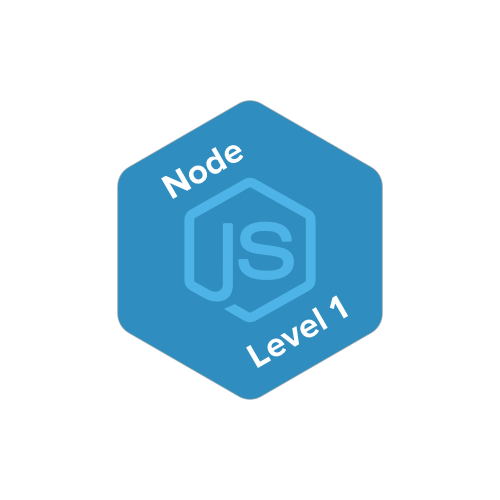
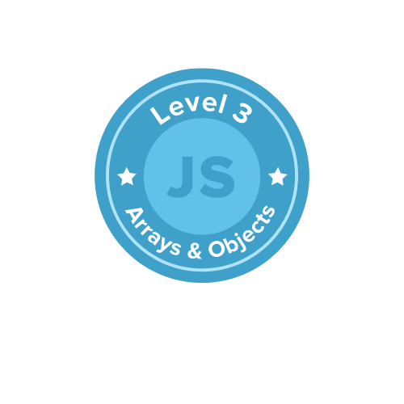
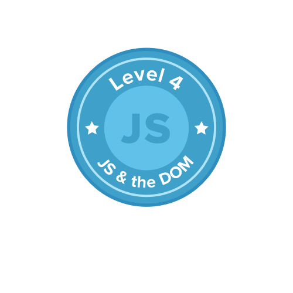

## Badges you can earn!

The Badges below represent achievement in a range of categories.

### GitHub

#### Commits

**[100 Commits](https://badgr.com/public/badges/8nY3MIUVRTCER-ObLZQcAg)** - Earn this badge by making 100 commits to github.

#### Daily Commits

**[5 Commits in a Day](https://badgr.com/public/badges/D5KhEgQ8TFaPNGr7erx6pA)** - Earn this badge by making 5 commits in a day.

**[10 Commits in a Day](https://badgr.com/public/badges/eutqTD-oQhyk1dDnQIfGcw)** - Earn this badge by making 10 commits to GitHub in one day.

#### Streak

**[5 Day GitHub Streak](https://badgr.com/public/badges/eCNZRftqRNSaLNyR2KY6Nw)** - Earn this badge by making at least one commit to GitHub on each of 5 consecutive days.  

**[7 Day GitHub Streak](https://badgr.com/public/badges/Ku4-sQBpQ3qCFwaCBOj_AA)** - Earn this badge by making least one commit on each of 7 consecutive days

**[2 Week Streak - At least one commit on each of 14 consecutive days](https://badgr.com/public/badges/7Bl4_tpKQ7Kt1XSjUGmXxQ)** - Earn this badge by making at least one GitHub commit on each of 14 cosecutive days.

**[1 Month Streak - At least one commit on each of 30+ consecutive days](https://badgr.com/public/badges/1raVvbKfQNa3kkjYg3H4Vw)** - Earn -this badge by making a commit to GitHub on each of 30+ consecutive days.

#### Pull Requests

**[1st Pull Request](https://badgr.com/public/badges/Rn9njmZaRnK-SmeYc_eeAA)** - Earn this badge by making your first pull request on GitHub.

**[4th Pull Request](https://badgr.com/public/badges/QOuOITl3RV2FIcSNunn89A)** - Earn this badge by making your fourth pull request on GitHub.

**[10th Pull Request](https://badgr.com/public/badges/TT-LxRK0TOaixA1MePAeTg)** - Earn this badge by making your tenth pull request on GitHub.

<!-- 
### React 

### Redux

-->

<!-- Code Badges 

Badges 

JS Level 1.1 Breakout 
JS Level 1.2 Linting to professional standards 
JS Level 1.3 Networking 
JS Level 1.4 OOP 
JS Level 2.1 Map, Filter & Reduce
JS Level 2.2 React
JS Level 2.3 React Input Pattern
JS Level 2.4 Redux

JS Webpack Bundling 
JS 

React Level 1
React Level 2
React Level 3
React Level 4

JS Level 1 - Functons and Variables 
JS Level 2 - Flow Control 
JS Level 3 - Arrays and Objects 
JS Level 4 - OOP
JS Level 5 - Profesional Best Practices 
JS Level 6 - Map, Filter, and Reduce 
JS Level 7 - Networking 
JS Level 8 - Canvas 
JS Level 9 - 
JS Level 10 - Publish to nom 
JS Level 11 - 

-->

<h1>GitHub</h1>

These badges were earned for achievements with GitHub

  
  
  
  
  
  
  
  
  
  
  
  

<h1>JavaScript</h1>

These badges were earned for achievements with JavaScript

  
  
  
  
  
  
  
  
  
  
  
  
  
  
  
  

<h1>React</h1>

These badges were earned for achievements with React
 

  
  
  
  
  
  
  
  
  
  
  
  

<h1>Computer Science</h1>

These badges were earned for achievements in Computer Science

  
  
  
  
  
  
  
  
  
  
  
  
  
  
  
  
  
  
  
  
  
  
  
  

<h1>Mobile</h1>

These badges were earned for achievements with Mobile Development

  
  
  
  
  
  
  
  
  
  
  
  

<h1>Job Readiness</h1>

Earned for achievements in job preparation and interview practice.

  
  
  
  
  
  
  
  
  
  
  
  

<h1>Summer Academy</h1>

  
  
  
  
  
  
  
  
  
  
  
  

<h1>Community</h1>

Earned for community input and support.

  
  
  
  
  
  
  

<h1>Social Justice</h1>

Earned for making provide support to the goals of social progress.

  
  
  
  
  

<h1>Entrepreneurship</h1>

Earned for work on entrepreneurial goals.

  
  
  
  
  
  

<h1>GitHub</h1>

These badges were earned for achievements with GitHub

  
  
  
  
  
  
  
  
  
  
  
  

<h1>JavaScript</h1>

These badges were earned for achievements with JavaScript

  
  
  
  
  
  
  
  
  
  
  
  
  
  
  
  

<h1>React</h1>

These badges were earned for achievements with React
 

  
  
  
  
  
  
  
  
  
  
  
  

<h1>Computer Science</h1>

These badges were earned for achievements in Computer Science

  
  
  
  
  
  
  
  
  
  
  
  
  
  
  
  
  
  
  
  
  
  
  
  

<h1>Mobile</h1>

These badges were earned for achievements with Mobile Development

  
  
  
  
  
  
  
  
  
  
  
  

<h1>Job Readiness</h1>

Earned for achievements in job preparation and interview practice.

  
  
  
  
  
  
  
  
  
  
  
  

<h1>Summer Academy</h1>

  
  
  
  
  
  
  
  
  
  
  
  

<h1>Community</h1>

Earned for community input and support.

  
  
  
  
  
  
  

<h1>Social Justice</h1>

Earned for making provide support to the goals of social progress.

  
  
  
  
  

<h1>Entrepreneurship</h1>

Earned for work on entrepreneurial goals.

  
  
  
  
  
  

